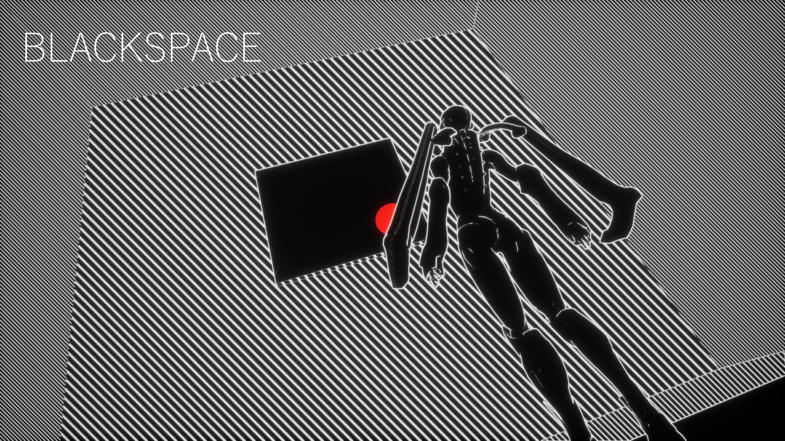

# BLACKSPACE 

## ✦ Description
This game was created in 48 hours for the [DISCORD JAM#2](https://itch.io/jam/discord-jam-2).

Blackspace is a puzzle-platformer game where you can wrap space itself! Either by teleporting yourself or attracting platforms can you find the exit to this three-dimensional labyrinth.

This game was made on Unreal Engine 4 by a team of 5 programmers.

## ✦ Credit
* Prog. Character: **Aymerick Allamele**
* Prog. Audio, UI & Polish: **Morgan Hoarau**
* Prog. Rendering: **Jannah Mekhaemar**
* Prog. Platform & LD: **Lukas Tamayo**
* Prog. Platform : **Etienne Kraemer**

